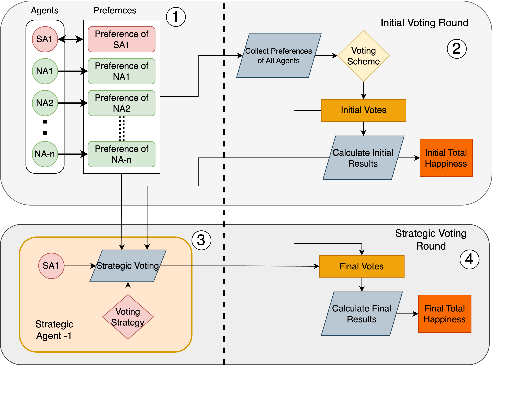
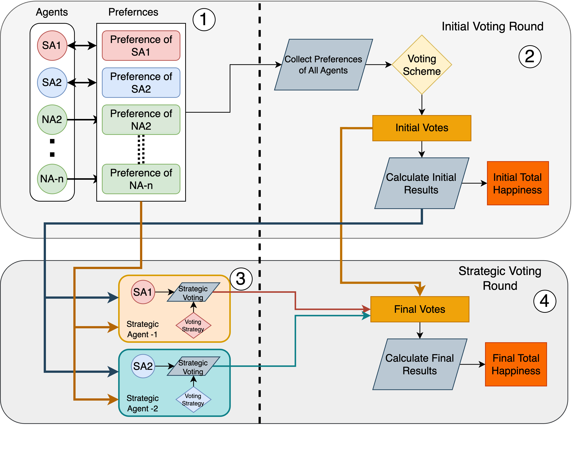

# TVA

**T**actical **V**oting **A**nalyst is a program that runs and experiments on Startegic Voting involving multiple Agents. Some of these agents are strategic agents who has full knowledge of the other agents and can manipulate votes to gain advantage or increase happiness. The program defines such an Environment, and runs experiments on different voting strategies, voting schemes, happiness types. 


## Usage

To run the happiness function independently
```bash

$ happiness.py --result "c1" "c2" "c3" --pref "c3" "c2" "c1" --happiness_type "A"
```

To run the environment for one voting round
```bash

$ enviroment.py --candidates 'c1' 'c2' 'c3' 'c4' --scheme 'borda' --strategy 'compromising' --num_agents 5 --num_strat_agents 2
```
To run experiments with multiple envirments 
```bash

$ experiments.py
```


## Design
**Basic TVA**
For the basic TVA where the number of startegic agent is limited to 1, All the agents provide their initial prefrence... 



**Advanced TVA**
In advanced TVA the number of agents can be more than 1..
